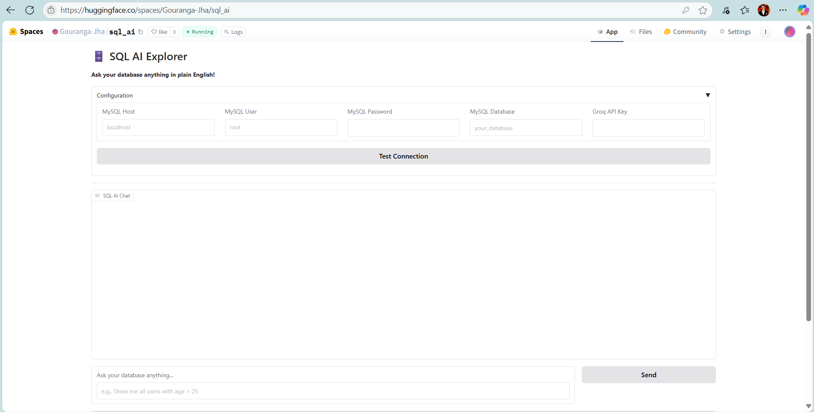
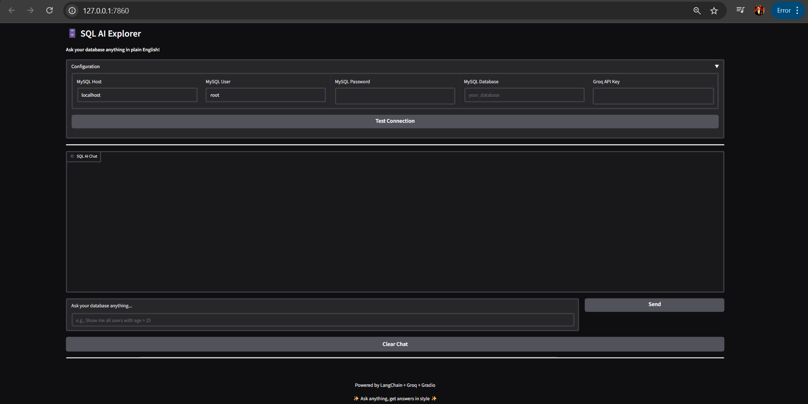
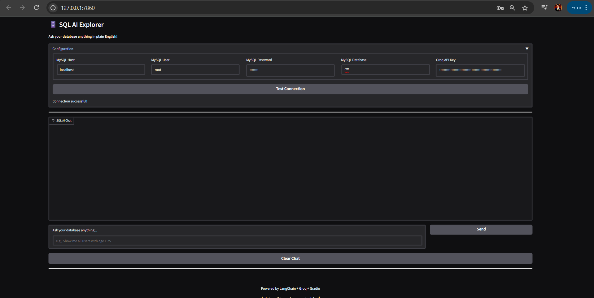
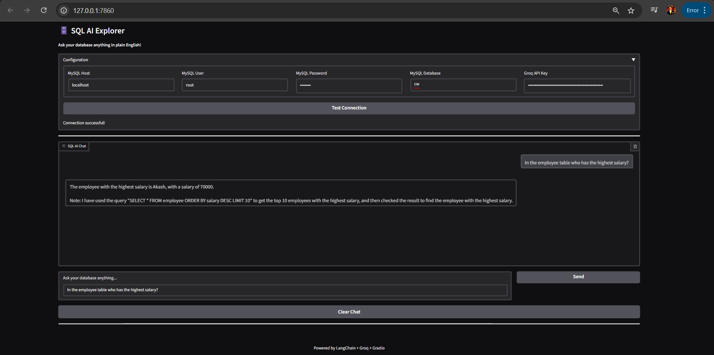
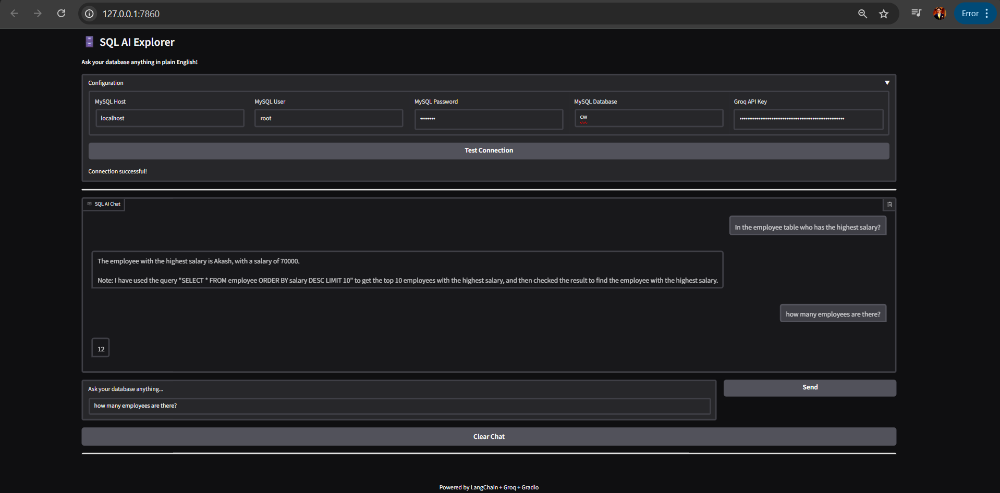

# SQL AI Explorer

A Gradio-powered web app that lets you interact with your MySQL database using natural language queries, powered by LangChain and Groq LLM. Visualize your data instantly with tables.

---

## 🚀 Features
- **Natural Language to SQL:** Ask questions in plain English and get SQL answers.
- **MySQL Database Support:** Connect to any MySQL database with your credentials.
- **Groq LLM Integration:** Uses Groq's Llama3-8b-8192 model for intelligent query generation.
- **Interactive Chat Interface:** Chat with your database, see history, and clear conversations.
- **Easy Configuration:** Set up database and API keys directly in the web UI.
- **Hugging Face Spaces Ready:** Designed for easy deployment on [Hugging Face Spaces](https://huggingface.co/spaces).

---

## 🛠️ Setup Instructions

### 1. Clone or Download
Clone this repo or download `gradio_sql_app.py` and `requirements.txt` to a folder.

### 2. Install Requirements
```bash
pip install -r requirements.txt
```

### 3. Run the App Locally
```bash
python gradio_sql_app.py
```
The app will open in your browser at `http://localhost:7860` by default.

---

## ⚙️ Usage
1. **Enter your MySQL connection details** (host, user, password, database) and your **Groq API key** in the configuration section.
2. **Test the connection** to ensure your credentials are correct.
3. **Ask questions** about your data in plain English (e.g., "Show me all users with age > 25").
4. **View results** as tables. Interact with your data visually!
5. **Clear chat** to start a new conversation.

---

## 🌐 Deploy on Hugging Face Spaces
1. Create a new Space (select Gradio as the SDK).
2. Upload `gradio_sql_app.py` and `requirements.txt`.
3. (Optional) Add a `README.md` for your Space.
4. Click "Deploy". Your app will be live and shareable!

---

## 🔑 Notes
- You need a valid [Groq API key](https://console.groq.com/keys) to use the LLM features.
- Your MySQL database must be accessible from the Hugging Face Spaces environment (consider firewall and network settings).
- For best results, use Python 3.10+.

---

## 📦 Requirements
See `requirements.txt` for all dependencies:
- gradio
- langchain
- langchain_groq
- langchain-community
- sqlalchemy
- mysql-connector-python
- pandas

---

## App Images











---

## 📝 License
This project is provided as-is for educational and demonstration purposes. 